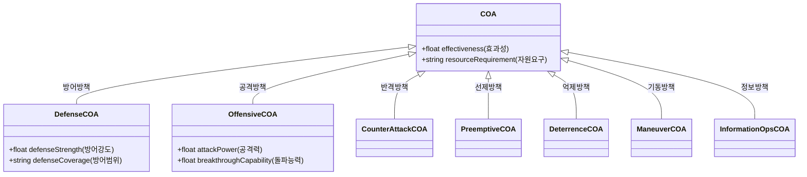

# 온톨로지 설계 문서

## 1. 개요
본 문서는 Defense Intelligent Agent Platform의 온톨로지 구조를 설명합니다. 특히 7가지 COA(Course of Action) 타입 확장에 따른 클래스 계층 구조와 속성을 상세히 기술합니다.

## 2. 클래스 계층 구조 (Class Hierarchy)



## 3. 주요 속성 (Properties)

### 3.1 데이터 속성 (Datatype Properties)

| 속성명 (URI) | 한글명 | 도메인 (Domain) | 범위 (Range) | 설명 |
|---|---|---|---|---|
| `effectiveness` | 효과성 | COA | float | 방책의 전반적인 효과성 점수 (0.0 ~ 1.0) |
| `resourceRequirement` | 자원요구 | COA | string | 방책 실행에 필요한 자원 설명 |
| `defenseStrength` | 방어강도 | DefenseCOA | float | 방어 진지의 견고함 수준 |
| `defenseCoverage` | 방어범위 | DefenseCOA | string | 방어 가능한 지리적 범위 |
| `attackPower` | 공격력 | OffensiveCOA | float | 공격 부대의 화력 수준 |
| `breakthroughCapability` | 돌파능력 | OffensiveCOA | float | 적 방어선을 돌파할 수 있는 능력 |

### 3.2 객체 속성 (Object Properties)

| 속성명 (URI) | 한글명 | 도메인 | 범위 | 설명 |
|---|---|---|---|---|
| `hasMission` | 임무수행 | Unit | Mission | 부대가 수행하는 임무 |
| `locatedIn` | 위치 | Entity | TerrainCell | 엔티티의 위치 |
| `hasThreat` | 위협식별 | Situation | Threat | 상황에서 식별된 위협 |
| `appliesTo` | 적용대상 | Constraint | Entity | 제약조건이 적용되는 대상 |

## 4. SPARQL 쿼리 예제

### 4.1 모든 방책 조회
```sparql
PREFIX ns1: <http://coa-agent-platform.org/ontology#>
PREFIX rdfs: <http://www.w3.org/2000/01/rdf-schema#>

SELECT ?coa ?label ?type
WHERE {
    ?coa a/rdfs:subClassOf* ns1:COA .
    ?coa rdfs:label ?label .
    ?coa a ?typeClass .
    ?typeClass rdfs:label ?type .
    FILTER(LANG(?label) = "ko" && LANG(?type) = "ko")
}
```

### 4.2 공격력이 0.8 이상인 공격 방책 조회
```sparql
PREFIX ns1: <http://coa-agent-platform.org/ontology#>

SELECT ?coa ?power
WHERE {
    ?coa a ns1:OffensiveCOA .
    ?coa ns1:attackPower ?power .
    FILTER(?power >= 0.8)
}
```

### 4.3 특정 위협에 대응하는 방어 방책 조회 (추론 예시)
```sparql
PREFIX ns1: <http://coa-agent-platform.org/ontology#>

SELECT ?coa ?threat
WHERE {
    ?coa a ns1:DefenseCOA .
    ?coa ns1:counters ?threat .
    ?threat ns1:threatLevel ?level .
    FILTER(?level > 0.7)
}
```

## 5. COA 타입별 상세 정의

| 타입 | 한글명 | 정의 및 목적 | 주요 속성 |
|---|---|---|---|
| **DefenseCOA** | 방어방책 | 적의 공격을 저지하고 아군 자산을 보호하기 위한 방책 | `defenseStrength`, `defenseCoverage` |
| **OffensiveCOA** | 공격방책 | 적의 주요 자산을 타격하여 무력화하기 위한 방책 | `attackPower`, `breakthroughCapability` |
| **CounterAttackCOA** | 반격방책 | 적의 공격을 방어한 후 역습을 가하는 방책 | `counterTiming`, `reserveForce` |
| **PreemptiveCOA** | 선제방책 | 적의 공격 징후를 포착하여 선제적으로 타격하는 방책 | `detectionRange`, `strikeSpeed` |
| **DeterrenceCOA** | 억제방책 | 무력 시위 등을 통해 적의 도발 의지를 꺾는 방책 | `showOfForce`, `psychologicalEffect` |
| **ManeuverCOA** | 기동방책 | 부대의 위치를 유리한 곳으로 이동시키는 방책 | `mobilitySpeed`, `terrainAdaptability` |
| **InformationOpsCOA** | 정보방책 | 적의 지휘통제 체계를 교란하거나 정보를 수집하는 방책 | `intelligenceLevel`, `cyberCapability` |

## 6. 추론 규칙 (Inference Rules) 예시

SWRL (Semantic Web Rule Language) 형식의 추론 규칙 예시입니다.

### 6.1 고위협 상황 시 방어 강화
```swrl
Situation(?s) ^ hasThreatLevel(?s, ?l) ^ swrlb:greaterThan(?l, 0.8) 
-> recommendsCOA(?s, DefenseCOA)
```

### 6.2 자원 부족 시 기동 방책 우선
```swrl
Unit(?u) ^ hasResourceLevel(?u, ?r) ^ swrlb:lessThan(?r, 0.4)
-> recommendsCOA(?u, ManeuverCOA)
```

### 6.3 적 약점 노출 시 공격 방책 추천
```swrl
Threat(?t) ^ hasWeakness(?t, ?w) ^ isExposed(?w, true)
-> recommendsCOA(?t, OffensiveCOA)
```

---

**작성일**: 2025년 12월  
**최종 업데이트**: 2025-12-18  
**버전**: 1.0
