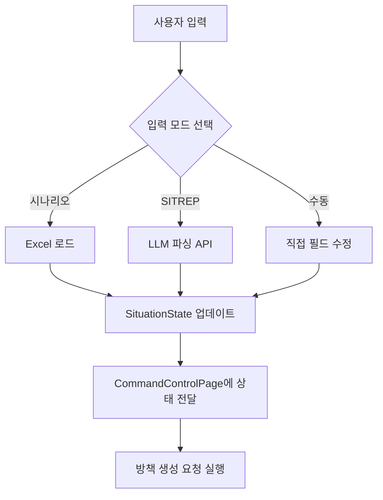

# 상황 입력 (Dashboard)

## 1. 개요

- **역할**: 사용자로부터 전술 상황 정보(임무, 위협)를 입력받음
- **위치**: Command Layer (Frontend)
- **컴포넌트**: `frontend/src/components/SituationInputPanel.tsx`

`SituationInputPanel`은 사용자가 전술 상황을 설정하는 핵심 인터페이스입니다. 데모 시나리오, SITREP 자연어 입력, 수동 방식 등을 지원하여 유연한 상황 조성을 가능케 합니다.

---

## 2. 주요 기능

### 2.1 입력 모드
`SituationInputPanel`은 다음과 같은 4가지 입력 방식을 지원합니다.

1. **Real-data Selection**: 데이터베이스에 등록된 실제 위협 목록에서 선택 (가장 일반적인 모드)
2. **Scenario Selection**: `시나리오모음.xlsx`에 정의된 사전 구성된 데모 시나리오 로드
3. **SITREP (자연어)**: 상황 보고 텍스트를 입력하면 LLM이 위협 요소와 임무를 자동 파싱
4. **Manual Input**: 위협 유형, 위치, 심각도 등을 사용자가 직접 상세 설정

### 2.3 주요 연동 데이터
- **위협 상황**: `위협상황.xlsx`, `위협유형_마스터.xlsx`
- **임무 정보**: `임무정보.xlsx`
- **아군 부대**: `아군부대현황.xlsx`, `아군가용자산.xlsx`

---

## 3. 구현 상세

### 3.1 주요 상태 관리 (React Context/State)
```typescript
interface SituationState {
  missionId: string | null;
  threatId: string | null;
  situationText: string;
  // ... 기타 위협 상세 필드
}
```

### 3.2 핵심 핸들러
- `handleScenarioChange`: 시나리오 선택 시 관련 위협 및 임무 정보 일괄 업데이트
- `handleAnalyzeSITREP`: LLM API(`POST /api/v1/agent/parse-sitrep`) 호출 및 결과 파싱
- `handleGenerateCOA`: 설정된 상황 정보를 기반으로 방책 생성 요청 (`POST /api/v1/coa/generate-coas-unified`)

---

## 4. 데이터 흐름



---

## 5. API 연동

### 5.1 시나리오 로드
- **Endpoint**: `GET /api/v1/system/scenarios`
- **Response**: 시나리오 목록 및 각 시나리오별 상세 위협/임무 매핑 정보

### 5.2 SITREP 분석
- **Endpoint**: `POST /api/v1/agent/parse-sitrep`
- **Request**: `{ text: string }`
- **Response**: 파싱된 위협 유형, 위치, 중요도 등

---

## 6. 관련 파일
- `frontend/src/components/SituationInputPanel.tsx`: 상황 입력 UI 로직
- `api/routers/system.py`: 시나리오 데이터 제공 API
- `api/routers/agent.py`: SITREP 분석 API


---

**작성일**: 2025년 12월  
**버전**: 1.0

