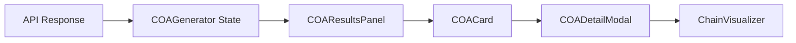

# 방책 결과 시각화 (COA Results)

## 1. 개요

- **역할**: 생성된 방책 후보들을 평가 점수에 따라 시각화하고 상세 정보를 제공
- **위치**: Command Layer (Frontend)
- **컴포넌트**: `frontend/src/components/COAResultsPanel.tsx`, `COAGenerator.tsx`

`COAResultsPanel`은 Agent가 제안한 방책들을 카드 형태로 나열하며, 사용자가 각 방책의 타당성을 즉각적으로 판단할 수 있도록 요약 점수와 주요 지표를 시각화합니다.

---

## 2. 주요 기능

### 2.1 방책 리스트 및 필터링
- **Top 3 하이라이트**: 가장 높은 점수를 받은 상위 3개 방책 강조
- **점수 기반 정렬**: 위협 대응, 자원 가용성 등 종합 점수순 정렬
- **상태 카드**: 각 방책의 핵심 정보(유형, 예상 성공률, 소요 시간 등) 요약

### 2.2 점수 Breakdown (7대 요소)
- 위협대응, 자원가용성, 전력능력, 환경적합성, 효과성, 연계성, 임무부합성
- 각 요소를 **Ant Design Progress Bar** 또는 **Radar Chart** 형태로 시각화
- 가중치가 적용된 실제 기여도 표시

### 2.3 상세 분석 모달 (`COADetailModal`)
- **수행 계획**: 단계별 행동 요령 및 배치 부대 상세
- **추론 근거**: AI가 해당 방책을 추천한 논리적 이유 (자연어 설명)
- **전술 체인**: 위협부터 방책까지 연결되는 온톨로지 관계 시각화 (`ChainVisualizer`)

---

## 3. 구현 상세

### 3.1 주요 컴포넌트 구조
```tsx
// frontend/src/components/COAResultsPanel.tsx
const COAResultsPanel: React.FC<{
  results: COAResult[];
  onSelect: (coa: COAResult) => void;
}> = ({ results, onSelect }) => {
  // ... 방책 리스트 렌더링
}
```

### 3.2 점수 시각화 로직
- **Color Mapping**: 
  - 80% 이상: Success (Green)
  - 60~80%: Info (Blue)
  - 40~60%: Warning (Orange)
  - 40% 미만: Error (Red)

---

## 4. 데이터 흐름



---

## 5. UI/UX 요소

- **인터랙티브 카드**: 클릭 시 지도상의 유닛 위치 하이라이트 및 경로 표시 연동
- **비교 보기**: 여러 방책의 점수 구성을 한눈에 비교할 수 있는 레이아웃
- **실시간 로그**: 점수 산정 과정의 `trace` 로그 실시간 확인 기능

---

## 6. 관련 파일
- `frontend/src/components/COAResultsPanel.tsx`: 리스트 및 요약 UI
- `frontend/src/components/COADetailModal.tsx`: 상세 분석 팝업
- `frontend/src/components/ReasoningExplanationPanel.tsx`: AI 추론 근거 표출
- `frontend/src/components/ChainVisualizer.tsx`: 온톨로지 체인 시각화

---

**작성일**: 2026년 1월
**버전**: 2.5 (React Integration Refined)
