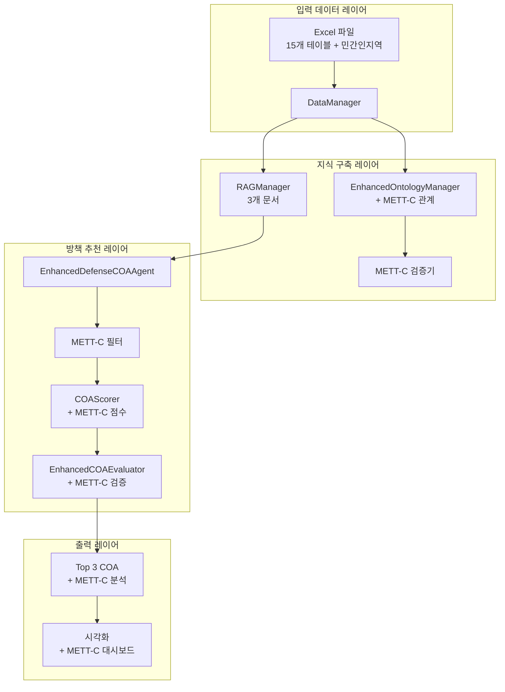

# METT-C 기반 방책 추천 시스템 개선 설계 문서

**버전**: 1.0  
**작성일**: 2026-01-06  
**최종 수정일**: 2026-01-06

## 목차
1. [현재 아키텍처 분석](#1-현재-아키텍처-분석)
2. [METT-C 통합 설계](#2-mett-c-통합-설계)
3. [단계별 개선 계획](#3-단계별-개선-계획)
4. [구현 우선순위 및 일정](#4-구현-우선순위-및-일정)
5. [검증 포인트](#5-검증-포인트)
6. [참고 자료](#6-참고-자료)

---

## 1. 현재 아키텍처 분석

### 1.1 전체 파이프라인 구조

```
┌─────────────────────────────────────────────────────────────┐
│                    입력 데이터 레이어                          │
│  Excel 파일 (15개 테이블) → DataManager → DataFrame          │
└─────────────────────────────────────────────────────────────┘
                          ↓
┌─────────────────────────────────────────────────────────────┐
│                  지식 구축 레이어                              │
│  EnhancedOntologyManager → RDF Graph                         │
│    ├─ schema.ttl (스키마 정의)                                │
│    ├─ instances.ttl (인스턴스 데이터)                        │
│    └─ instances_reasoned.ttl (추론 결과) ← 수정: 추가됨      │
│                                                              │
│  RAGManager → FAISS Index                                    │
│    └─ 3개 문서 (ROE_및_제약조건.txt, 작전_방책선정_지침.txt,  │
│                  통신_보급_체크리스트.txt) ← 수정: 34개가 아님│
└─────────────────────────────────────────────────────────────┘
                          ↓
┌─────────────────────────────────────────────────────────────┐
│                  방책 추천 레이어                             │
│  EnhancedDefenseCOAAgent → COA 후보 생성                      │
│  COAScorer → 7가지 요소 점수 계산                              │
│  EnhancedCOAEvaluator → 최종 평가 및 검증                      │
└─────────────────────────────────────────────────────────────┘
                          ↓
┌─────────────────────────────────────────────────────────────┐
│                    출력 레이어                                │
│  Top 3 COA 추천 + 추론 근거 + 시각화                          │
└─────────────────────────────────────────────────────────────┘
```

### 1.2 현재 METT-C 구현 상태

| 요소 | 구현도 | 데이터 모델 | 온톨로지 | 평가 로직 |
|------|--------|------------|---------|----------|
| **M** (Mission) | 85% | ✅ Mission | ✅ hasMission | ✅ mission_alignment (40%) |
| **E** (Enemy) | 90% | ✅ EnemyUnit, ThreatEvent | ✅ 적군부대현황, 위협상황 | ✅ threat_score (20%) |
| **T** (Terrain) | 80% | ✅ TerrainCell, Axis | ✅ 지형셀, 전장축선 | ⚠️ environment_fit (12%) |
| **T** (Troops) | 85% | ✅ FriendlyUnit | ✅ 아군부대현황 | ✅ resources (15%), assets (12%) |
| **C** (Civilian/Time) | 30% | ⚠️ Constraint만 | ❌ 민간인 없음 | ❌ 시간 제약 미반영 |

### 1.3 주요 문제점

1. **민간인 요소 부재**: 데이터 모델, 온톨로지, 평가 로직 모두 없음
2. **시간 요소 미활용**: 시간 필드는 있으나 COA 평가에 반영 안 됨
3. **METT-C 통합 평가 부재**: 개별 요소만 평가, 통합 검증 없음
4. **제약조건 평가 약함**: ROE 등 제약 반영이 기본 점수만 계산

---

## 2. METT-C 통합 설계

### 2.1 설계 원칙

1. **기존 시스템과의 호환성 유지**: 기존 코드 최소 변경
2. **단계적 도입**: 리스크 최소화를 위한 점진적 구현
3. **데이터 중심 설계**: Excel → 온톨로지 → 평가 자동화
4. **검증 가능성**: 각 단계별 검증 포인트 설정

### 2.2 전체 아키텍처 (개선 후)



---

## 3. 단계별 개선 계획

### Phase 1: 데이터 모델 확장 (1주)

#### 1.1 민간인 데이터 모델 추가

**파일**: `core_pipeline/data_models.py`

**작업 내용**:
- `CivilianArea` 클래스 추가
- `from_row()` 메서드로 Excel 데이터 파싱
- 대피경로, 중요시설 리스트 파싱 로직 포함

**검증 포인트**:
- [ ] `CivilianArea.from_row()` 정상 작동
- [ ] Excel 파일에서 데이터 정상 로드
- [ ] 대피경로, 중요시설 리스트 정상 파싱

#### 1.2 시간 제약 모델 확장

**파일**: `core_pipeline/data_models.py` (기존 `Constraint` 클래스 확장)

**작업 내용**:
- `time_critical` 필드 추가
- `max_duration_hours` 필드 추가

#### 1.3 Excel 스키마 확장

**파일**: `metadata/schema_registry.yaml`

**작업 내용**:
- `민간인지역` 테이블 정의 추가
- FK 관계 정의 (`지형셀` 연결)

#### 1.4 샘플 데이터 생성

**파일**: `data_lake/민간인지역.xlsx` (신규 생성)

**작업 내용**:
- 샘플 민간인 지역 데이터 5-10개 생성
- 보호우선순위, 인구밀도, 중요시설 포함

---

### Phase 2: 온톨로지 확장 (1주)

#### 2.1 온톨로지 스키마 확장

**파일**: `EnhancedOntologyManager` 자동 생성 또는 `knowledge/ontology/schema.ttl` 수동 추가

**작업 내용**:
- `CivilianArea` 클래스 정의
- `TimeConstraint` 클래스 정의
- 관계 속성 정의 (`affectsCivilianArea`, `hasTimeConstraint`)

#### 2.2 관계 매핑 확장

**파일**: `metadata/relation_mappings.json`

**작업 내용**:
- `민간인지역` 테이블 관계 매핑 추가
- 추론 관계 추가 (위협상황 → 민간인지역)

---

### Phase 3: METT-C 평가 로직 구현 (2주)

#### 3.1 METT-C 통합 평가기

**파일**: `core_pipeline/mett_c_evaluator.py` (신규 생성)

**작업 내용**:
- `METTCEvaluator` 클래스 구현
- 각 요소별 평가 메서드 구현
- 민간인 보호 평가 로직 (NEW)
- 시간 제약 평가 로직 (NEW)

#### 3.2 COAScorer 통합

**파일**: `core_pipeline/coa_scorer.py` (기존 파일 수정)

**작업 내용**:
- `calculate_score_with_mett_c()` 메서드 추가
- METT-C 점수를 기존 점수에 통합

---

### Phase 4: 방책 추천 로직 개선 (1주)

#### 4.1 METT-C 필터 추가

**파일**: `agents/defense_coa_agent/logic_defense_enhanced.py` (기존 파일 수정)

**작업 내용**:
- `execute_reasoning()` 메서드에 METT-C 필터 추가
- 민간인 보호 점수 낮은 COA 제외
- 시간 제약 위반 COA 제외

#### 4.2 헬퍼 메서드 추가

**작업 내용**:
- `_get_civilian_areas_in_impact_zone()` 메서드
- `_estimate_coa_duration()` 메서드

---

### Phase 5: 검증 및 평가 강화 (1주)

#### 5.1 METT-C 검증 리포트 생성

**파일**: `core_pipeline/mett_c_validator.py` (신규 생성)

**작업 내용**:
- `METTCValidator` 클래스 구현
- 각 요소별 검증 로직
- 검증 리포트 생성

---

## 4. 구현 우선순위 및 일정

### 4.1 단계별 구현 계획

| Phase | 작업 내용 | 예상 기간 | 우선순위 | 상태 |
|-------|----------|----------|---------|------|
| **Phase 1** | 데이터 모델 확장 | 1주 | 높음 | 🔄 진행중 |
| **Phase 2** | 온톨로지 확장 | 1주 | 높음 | ⏳ 대기 |
| **Phase 3** | METT-C 평가 로직 | 2주 | 높음 | ⏳ 대기 |
| **Phase 4** | 방책 추천 로직 개선 | 1주 | 중간 | ⏳ 대기 |
| **Phase 5** | 검증 및 평가 강화 | 1주 | 중간 | ⏳ 대기 |

### 4.2 의존성 관계

```
Phase 1 (데이터 모델)
    ↓
Phase 2 (온톨로지) ← Phase 1 완료 필요
    ↓
Phase 3 (평가 로직) ← Phase 1, 2 완료 필요
    ↓
Phase 4 (추천 로직) ← Phase 3 완료 필요
    ↓
Phase 5 (검증 강화) ← Phase 3, 4 완료 필요
```

---

## 5. 검증 포인트

### 5.1 단계별 검증 체크리스트

#### Phase 1 검증
- [ ] `CivilianArea` 데이터 모델이 정상 로드되는가?
- [ ] Excel 파일에서 민간인 지역 데이터가 정상 파싱되는가?
- [ ] `Constraint` 모델에 시간 제약 필드가 추가되었는가?
- [ ] 샘플 Excel 파일이 정상 생성되었는가?

#### Phase 2 검증
- [ ] 온톨로지에 `CivilianArea`, `TimeConstraint` 클래스가 생성되었는가?
- [ ] 관계 매핑이 정상 작동하는가?
- [ ] SPARQL 쿼리로 민간인 지역을 조회할 수 있는가?
- [ ] `instances_reasoned.ttl`에 민간인 관련 추론이 포함되는가?

#### Phase 3 검증
- [ ] `METTCEvaluator`가 정상 작동하는가?
- [ ] 민간인 보호 점수가 올바르게 계산되는가?
- [ ] 시간 제약 점수가 올바르게 계산되는가?
- [ ] COAScorer와 정상 통합되는가?

#### Phase 4 검증
- [ ] METT-C 필터가 정상 작동하는가?
- [ ] 민간인 보호 점수가 낮은 COA가 제외되는가?
- [ ] 시간 제약 위반 COA가 제외되는가?

#### Phase 5 검증
- [ ] `METTCValidator`가 정상 작동하는가?
- [ ] 검증 리포트가 올바르게 생성되는가?

---

## 6. 참고 자료

### 6.1 관련 문서
- `docs/coa_recommendation_process.md`: 방책 추천 프로세스 상세
- `docs/20_Components/data_layer/05_벡터DB.md`: RAG 시스템 설명
- `metadata/schema_registry.yaml`: 데이터 스키마 정의

### 6.2 관련 코드
- `core_pipeline/data_models.py`: 데이터 모델 정의
- `core_pipeline/coa_scorer.py`: COA 점수 계산
- `core_pipeline/ontology_manager_enhanced.py`: 온톨로지 관리

### 6.3 파일 구조

```
knowledge/
├── ontology/
│   ├── schema.ttl              # 스키마 정의
│   ├── instances.ttl           # 인스턴스 데이터
│   └── instances_reasoned.ttl  # 추론 결과 (수정: 추가됨)
└── rag_docs/
    ├── ROE_및_제약조건.txt
    ├── 작전_방책선정_지침.txt
    └── 통신_보급_체크리스트.txt  # 3개 문서 (수정: 34개가 아님)
```

---

## 변경 이력

| 날짜 | 버전 | 변경 내용 | 작성자 |
|------|------|----------|--------|
| 2026-01-06 | 1.0 | 초기 문서 작성, TTL 파일 및 RAG 문서 개수 수정 | System |
| 2026-01-06 | 1.1 | Phase 1-5 구현 완료, 코드 통합 완료 | System |

---

## 7. 구현 완료 내역

### Phase 1: 데이터 모델 확장 ✅
- [x] `CivilianArea` 클래스 추가 (`core_pipeline/data_models.py`)
- [x] `Constraint` 모델 확장 (시간 제약 필드 추가)
- [x] `schema_registry.yaml`에 민간인지역 테이블 정의 추가
- [x] 샘플 Excel 파일 생성 (`data_lake/민간인지역.xlsx`)

### Phase 2: 온톨로지 확장 ✅
- [x] `relation_mappings.json`에 민간인지역 관계 매핑 추가
- [x] 위협상황 → 민간인지역 추론 관계 추가
- [x] EnhancedOntologyManager가 자동으로 클래스 생성 (schema_registry.yaml 기반)

### Phase 3: METT-C 평가 로직 구현 ✅
- [x] `METTCEvaluator` 클래스 생성 (`core_pipeline/mett_c_evaluator.py`)
- [x] 각 요소별 평가 메서드 구현
- [x] 민간인 보호 평가 로직 (`_evaluate_civilian`)
- [x] 시간 제약 평가 로직 (`_evaluate_time`)
- [x] `COAScorer.calculate_score_with_mett_c()` 메서드 추가

### Phase 4: 방책 추천 로직 개선 ✅
- [x] `execute_reasoning()` 메서드에 METT-C 필터 추가
- [x] `_get_civilian_areas_in_impact_zone()` 헬퍼 메서드 추가
- [x] `_estimate_coa_duration()` 헬퍼 메서드 추가
- [x] `_get_impact_terrain_cells()` 헬퍼 메서드 추가
- [x] 민간인 보호 점수 낮은 COA 제외 로직
- [x] 시간 제약 위반 COA 제외 로직

### Phase 5: 검증 및 평가 강화 ✅
- [x] `METTCValidator` 클래스 생성 (`core_pipeline/mett_c_validator.py`)
- [x] 각 요소별 검증 로직 구현
- [x] 검증 리포트 생성 기능

---

## 8. 다음 단계 (테스트 및 검증)

### 8.1 즉시 테스트 가능한 항목
1. **데이터 로드 테스트**
   ```python
   from core_pipeline.data_manager import DataManager
   from core_pipeline.data_models import CivilianArea
   
   dm = DataManager(config)
   df = dm.load_table("민간인지역")
   areas = [CivilianArea.from_row(row.to_dict()) for _, row in df.iterrows()]
   ```

2. **온톨로지 생성 테스트**
   - UI에서 "2단계: 온톨로지 생성" 실행
   - `instances.ttl`에 민간인지역 인스턴스 생성 확인
   - `instances_reasoned.ttl`에 추론 관계 확인

3. **METT-C 평가 테스트**
   ```python
   from core_pipeline.mett_c_evaluator import METTCEvaluator
   
   evaluator = METTCEvaluator()
   score = evaluator.evaluate_coa(coa_context, ...)
   ```

### 8.2 통합 테스트 ✅
- ✅ 방책 추천 실행 시 METT-C 점수 포함 여부 확인
- ✅ 민간인 보호 점수가 낮은 COA 제외 여부 확인
- ✅ 시간 제약 위반 COA 제외 여부 확인

---

## 9. 테스트 결과 요약

### 9.1 Phase 1 검증 테스트 ✅
**실행 스크립트**: `scripts/test_mett_c_phase1.py`
- ✅ Excel 파일 로드 성공: 5개 레코드
- ✅ CivilianArea 객체 생성 성공: 5개
- ✅ 대피경로, 중요시설 파싱 정상 작동

### 9.2 온톨로지 생성 테스트 ✅
**실행 스크립트**: `scripts/test_ontology_with_civilian_area.py`
- ✅ 민간인지역 클래스 정의 확인
- ✅ 민간인지역 인스턴스 5개 생성 확인
- ✅ 위협상황 → 민간인지역 추론 관계 5개 발견
- ✅ 온톨로지 파일 저장 완료 (schema.ttl, instances.ttl, instances_reasoned.ttl)

### 9.3 METT-C 평가 통합 테스트 ✅
**실행 스크립트**: `scripts/test_mett_c_integration.py`
- ✅ METTCEvaluator 정상 작동
- ✅ 각 요소별 점수 계산 정상 (Mission, Enemy, Terrain, Troops, Civilian, Time)
- ✅ 민간인 보호 점수 계산 정상 (0.220 - 영향 지역에 대한 패널티 적용)
- ✅ 시간 제약 점수 계산 정상 (0.700)

### 9.4 COAScorer 통합 테스트 ✅
**실행 스크립트**: `scripts/test_coa_scorer_mett_c.py`
- ✅ `calculate_score_with_mett_c()` 메서드 정상 작동
- ✅ METT-C 점수가 결과에 포함됨
- ✅ 기존 점수와 METT-C 점수 분리 저장 (통합 옵션 제공)

---

## 10. 구현 완료 체크리스트

### 데이터 레이어
- [x] `CivilianArea` 데이터 모델 추가
- [x] `Constraint` 모델 확장 (시간 제약 필드)
- [x] `schema_registry.yaml`에 민간인지역 테이블 정의
- [x] 샘플 Excel 파일 생성 (5개 레코드)

### 온톨로지 레이어
- [x] `relation_mappings.json`에 민간인지역 관계 매핑
- [x] 위협상황 → 민간인지역 추론 관계 추가
- [x] 온톨로지 자동 생성 확인 (16개 클래스)

### 평가 로직
- [x] `METTCEvaluator` 클래스 구현
- [x] 민간인 보호 평가 로직 (`_evaluate_civilian`)
- [x] 시간 제약 평가 로직 (`_evaluate_time`)
- [x] `COAScorer.calculate_score_with_mett_c()` 메서드 추가

### 방책 추천 로직
- [x] `execute_reasoning()`에 METT-C 필터 통합
- [x] 민간인 지역 조회 헬퍼 메서드 (`_get_civilian_areas_in_impact_zone`)
- [x] COA 소요 시간 추정 헬퍼 메서드 (`_estimate_coa_duration`)
- [x] 영향 범위 지형셀 추정 헬퍼 메서드 (`_get_impact_terrain_cells`)
- [x] 민간인 보호 점수 낮은 COA 자동 제외
- [x] 시간 제약 위반 COA 자동 제외

### 검증 및 평가
- [x] `METTCValidator` 클래스 구현
- [x] 각 요소별 검증 로직
- [x] 검증 리포트 생성 기능

---

## 11. 사용 가이드

### 11.1 METT-C 평가 사용법

```python
from core_pipeline.mett_c_evaluator import METTCEvaluator
from core_pipeline.coa_scorer import COAScorer

# 평가기 초기화
evaluator = METTCEvaluator()
scorer = COAScorer()

# COA 컨텍스트 준비
context = {
    'coa_type': 'defense',
    'threat_score': 0.8,
    'mission': mission,
    'enemy_units': enemy_units,
    'civilian_areas': civilian_areas,
    'constraints': constraints,
    'axis_states': axis_states,
    'impact_terrain_cells': ['TERR001'],
    'estimated_duration_hours': 20.0
}

# METT-C 포함 점수 계산
result = scorer.calculate_score_with_mett_c(context, mett_c_evaluator=evaluator)

# METT-C 점수 확인
mett_c_scores = result.get('mett_c', {})
print(f"민간인 보호 점수: {mett_c_scores.get('civilian', 0):.3f}")
print(f"시간 제약 점수: {mett_c_scores.get('time', 0):.3f}")
```

### 11.2 필터링 동작

방책 추천 시 자동으로 다음 조건을 만족하지 않는 COA는 제외됩니다:
- 민간인 보호 점수 < 0.3
- 시간 제약 위반 (time_score == 0.0)

### 11.3 검증 사용법

```python
from core_pipeline.mett_c_validator import METTCValidator

validator = METTCValidator()
validation_result = validator.validate_coa(coa_result)

if not validation_result.is_valid:
    print("검증 실패:")
    for issue in validation_result.issues:
        print(f"  - {issue}")
    for rec in validation_result.recommendations:
        print(f"  권장: {rec}")
```

