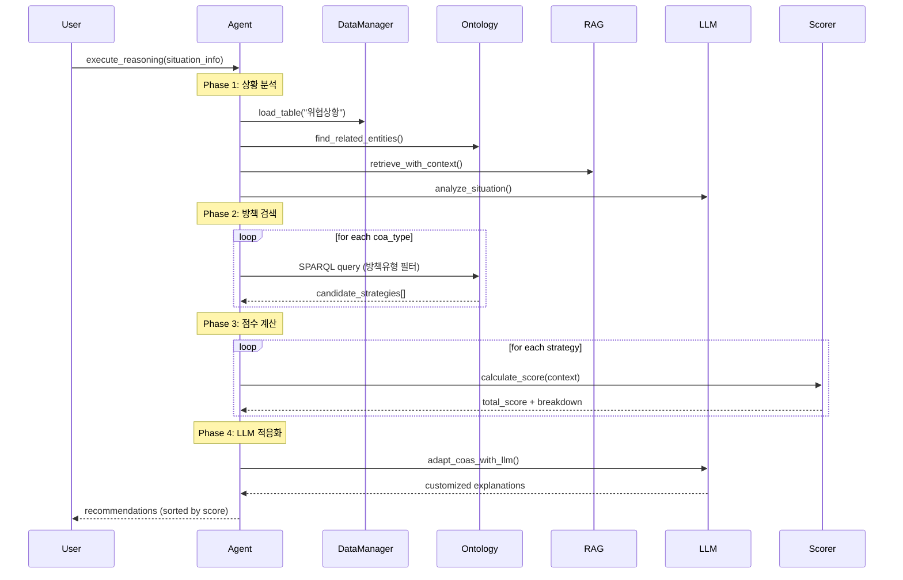

# 방책 추천 시스템

## 1. 개요

Defense Intelligent Agent Platform의 핵심 기능인 방책(COA) 추천 시스템은 상황 분석과 방책 추천을 통합적으로 수행하는 `EnhancedDefenseCOAAgent`를 중심으로 동작합니다.

### 주요 특징

- **7가지 방책 타입 지원**: 방어, 공격, 반격, 선제, 억제, 기동, 정보작전
- **4가지 입력 방식**: 실제 데이터, SITREP, 수동 입력, 데모 시나리오
- **하이브리드 추론**: 온톨로지 기반 추론 + RAG 검색 + LLM 협력
- **팔란티어 모드**: 7가지 요소 종합 평가

---

## 2. 시스템 구조

### 2.1 Agent 구조

**실제 구현**: `EnhancedDefenseCOAAgent` (단일 Agent 클래스)

```python
# agents/defense_coa_agent/logic_defense_enhanced.py
class EnhancedDefenseCOAAgent(BaseAgent):
    def execute_reasoning(self, situation_id, **kwargs):
        # 1. 상황 분석 (내부 메서드)
        situation_analysis = self._analyze_situation(...)
        
        # 2. COA 추천 (상황 분석 결과 사용)
        recommendations = self._recommend_by_type(...)
```

**핵심 메서드**:
- `_analyze_situation()`: 상황 분석 (다차원 분석, 관련 엔티티 탐색, RAG 검색, LLM 협력)
- `_recommend_by_type()`: 타입별 방책 추천
- `_score_with_palantir_mode()`: 팔란티어 모드 점수 계산

### 2.2 지원하는 방책 타입

```python
self.supported_coa_types = [
    "defense", "offensive", "counter_attack", 
    "preemptive", "deterrence", "maneuver", "information_ops"
]
```

**기본 동작**: `coa_type_filter`가 없으면 `["defense"]`만 추천 (하위 호환성)

---

## 3. 방책 추천 프로세스

### 3.1 전체 프로세스



### 3.2 Phase 1: 상황 분석

**메서드**: `_analyze_situation()`

**처리 과정**:
1. **상황 정보 로드**: `_load_situation()` 또는 `selected_situation_info` 사용
2. **다차원 분석**: `_analyze_situation_dimensions()` - 위협 심각도, 긴급도, 복잡도 분석
3. **관련 엔티티 탐색**: `_find_related_entities_enhanced()` - 온톨로지 그래프에서 관련 엔티티 조회
4. **RAG 검색**: `rag_manager.retrieve_with_context()` - 유사 상황 검색
5. **LLM 협력**: `_llm_analyze_situation()` - LLM이 상황을 의미 분석

**출력**:
```python
situation_analysis = {
    "situation_info": {...},
    "dimension_analysis": {...},
    "related_entities": [...],
    "rag_results": [...],
    "llm_insights": {...}
}
```

### 3.3 Phase 2: 방책 검색

**메서드**: `_search_strategies()`

**검색 방식**:
1. **온톨로지 기반**: SPARQL 쿼리로 방책유형 필터링
2. **임베딩 기반**: 유사도 검색 (선택적)
3. **하이브리드**: 두 방식 결합

**타입 필터링**:
```python
# 방책유형 컬럼으로 필터링
if coa_type:
    strategies = [s for s in strategies if s.get('방책유형') == coa_type]
```

### 3.4 Phase 3: 점수 계산

**팔란티어 모드**: `_score_with_palantir_mode()`
- 7가지 요소 종합 평가 (위협, 자원, 자산, 환경, 과거, 체인, 임무)
- 각 방책별 독립적인 컨텍스트 생성

**기본 모드**: `_score_strategies()`
- 하이브리드 점수: Agent 70% + LLM 30%

### 3.5 Phase 4: LLM 적응화

**메서드**: `_adapt_coas_with_llm()`

**처리**:
- 상위 방책들을 LLM에 전달
- 상황에 맞게 설명을 적응화
- 자연어 추천 이유 생성

---

## 4. 점수 산정 시스템

### 4.1 평가 요소 (6가지)

| 요소 | 코드명 | 설명 | 평가 방식 |
|------|--------|------|-----------|
| **위협 대응** | `threat` | 적 위협 수준에 대한 대응 능력 | 위협 수준(0.0~1.0)과의 비례 관계 |
| **자원 효율** | `resources` | 가용 자원 대비 소요 자원의 적절성 | (가용자원 / 소요자원) 비율 |
| **자산 능력** | `assets` | 아군 자산의 전투력 및 상태 | 자산별 능력치 평균 |
| **환경 적합** | `environment` | 지형, 기상 등 작전 환경과의 부합도 | 지형 계수 * 기상 계수 |
| **과거 사례** | `historical` | 유사 상황에서의 과거 성공률 | 과거 성공 사례의 평균 성공률 |
| **연계 작전** | `chain` | 다른 작전/방책과의 연계성 | 연계 가능한 방책 수에 비례 |
| **임무 부합성** | `mission_alignment` | 임무와 방책 타입의 적합성 | 사전 정의된 매트릭스 기반 점수 |

### 4.2 가중치 (기본값)

- **위협 대응**: 0.25 (가장 중요)
- **자원 효율**: 0.20
- **자산 능력**: 0.15
- **환경 적합**: 0.15
- **과거 사례**: 0.15
- **연계 작전**: 0.10
- **임무 부합성**: 0.20 (추가됨)

> **참고**: 가중치 총합은 항상 1.0이 되도록 정규화됩니다.

### 4.3 점수 계산 공식

**MAUT 방식**:
$$ Total Score = \sum (Score_i \times Weight_i) $$

**팔란티어 모드**:
1. 각 방책별로 독립적인 컨텍스트 생성
2. 6가지 요소별 점수 개별 계산
3. 특수 조건에 따른 가점/감점 적용

---

## 5. 방책 타입별 처리

### 5.1 타입 필터링

**기본값**: `["defense"]` (하위 호환성)

**모든 타입 추천**:
```python
result = agent.execute_reasoning(
    coa_type_filter=["all"],
    ...
)
```

**특정 타입만 추천**:
```python
result = agent.execute_reasoning(
    coa_type_filter=["offensive", "counter_attack"],
    ...
)
```

### 5.2 타입별 추천 실행

```python
for coa_type in target_types:
    type_recommendations = self._recommend_by_type(
        coa_type, 
        situation_id, 
        situation_info, 
        situation_analysis, 
        **kwargs
    )
    all_recommendations.extend(type_recommendations)
```

---

## 6. 추천 이유 생성

시스템은 단순히 점수만 제시하는 것이 아니라, **왜** 해당 방책이 추천되었는지 자연어로 설명합니다.

### 6.1 로직 흐름

1. **상위 요소 추출**: 가중 점수가 가장 높은 2~3개 요소 식별
2. **템플릿 매칭**: 각 요소별 점수 구간에 따른 설명 템플릿 선택
3. **문장 조합**: 추출된 설명들을 자연스러운 문장으로 연결

### 6.2 예시

> "위협 수준 90%에 대한 대응 점수(0.23)가 높으며, 자원 효율성(0.18) 측면에서도 우수하여 추천됩니다."

---

## 7. 주요 코드 위치

- **Agent 로직**: `agents/defense_coa_agent/logic_defense_enhanced.py`
- **점수 계산**: `core_pipeline/coa_scorer.py`
- **온톨로지 관리**: `core_pipeline/ontology_manager_enhanced.py`
- **RAG 관리**: `core_pipeline/rag_manager.py`
- **LLM 관리**: `core_pipeline/llm_manager.py`

---

## 8. 참고 자료

- `docs/점수_산정_시스템.md`: 점수 산정 상세 설명
- `docs/coa_recommendation_process.md`: 전체 프로세스 상세 문서
- `data_lake/COA_Library.xlsx`: 방책 라이브러리 데이터
- `data_lake/평가기준_가중치.xlsx`: 가중치 설정 파일

---

**작성일**: 2025년 12월  
**최종 업데이트**: 2025-12-18  
**버전**: 2.0 (통합 버전)

