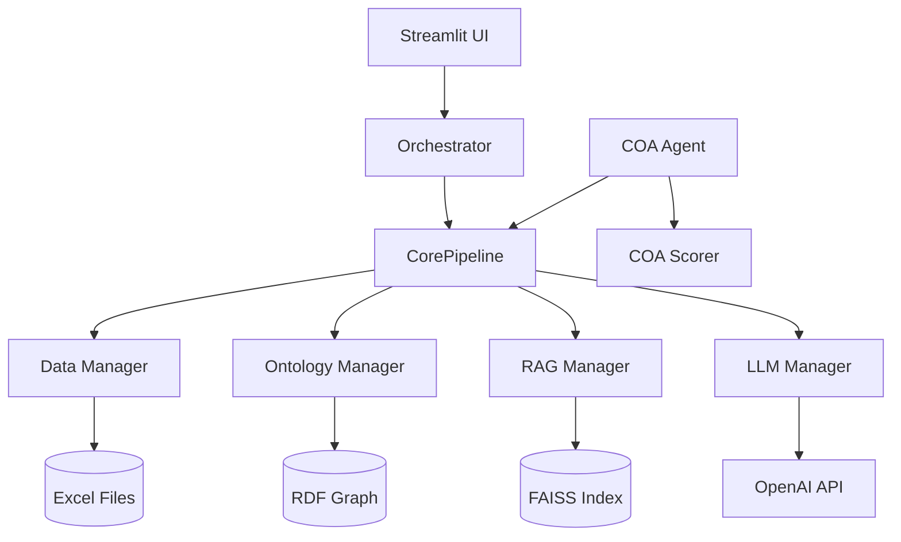
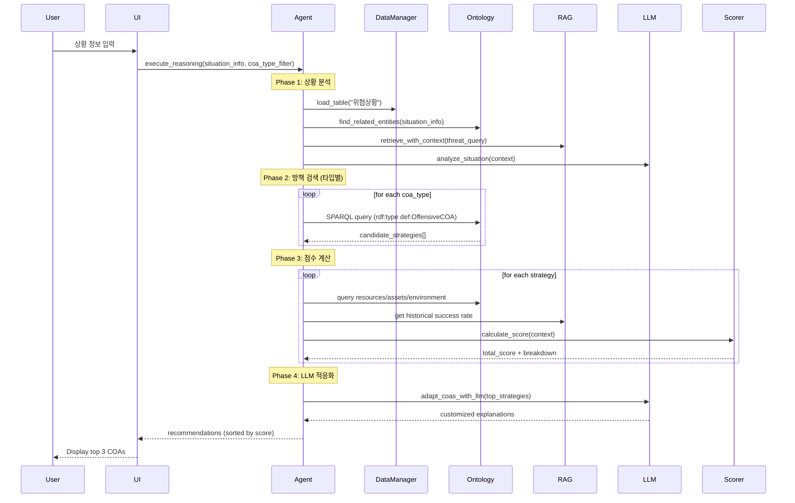
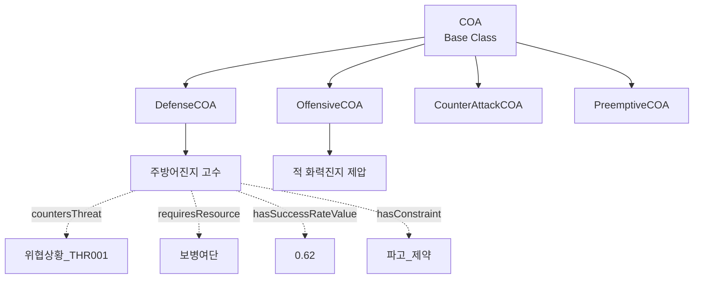
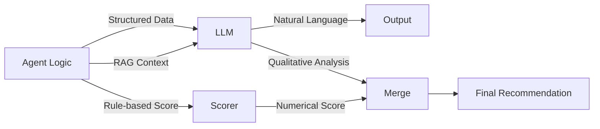
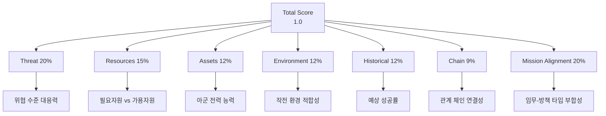
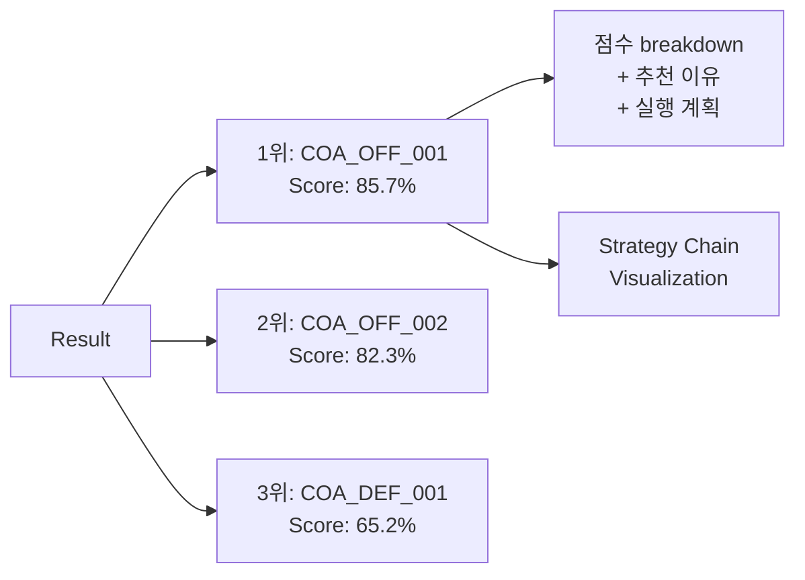
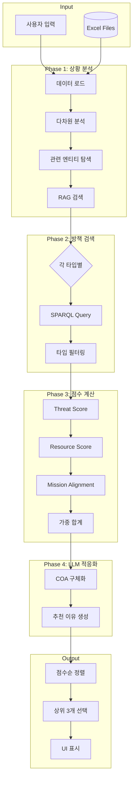

# 방책 추천 시스템 상세 프로세스 문서

## 목차
1. [시스템 아키텍처 개요](#1-시스템-아키텍처-개요)
2. [입력 정보](#2-입력-정보)
3. [데이터 흐름 및 처리 과정](#3-데이터-흐름-및-처리-과정)
4. [온톨로지 및 지식그래프 활용](#4-온톨로지-및-지식그래프-활용)
5. [RAG (검색 증강 생성) 활용](#5-rag-검색-증강-생성-활용)
6. [LLM 협력 메커니즘](#6-llm-협력-메커니즘)
7. [다중 요소 점수 계산](#7-다중-요소-점수-계산-palantir-mode)
8. [방책 타입별 처리](#8-방책-타입별-처리)
9. [최종 추천 생성](#9-최종-추천-생성)
10. [검증 포인트](#10-검증-포인트)
11. [향후 개선방향](#11-향후-개선방향)

---

## 1. 시스템 아키텍처 개요

### 핵심 컴포넌트



### 주요 모듈

| 모듈 | 역할 | 위치 |
|------|------|------|
| `Orchestrator` | 전체 파이프라인 조율 | `core_pipeline/orchestrator.py` |
| `DataManager` | Excel 데이터 로드 및 관리 | `core_pipeline/data_manager.py` |
| `OntologyManager` | RDF 그래프 구축 및 SPARQL 쿼리 | `core_pipeline/ontology_manager_enhanced.py` |
| `RAGManager` | 임베딩 기반 문서 검색 | `core_pipeline/rag_manager.py` |
| `LLMManager` | OpenAI/로컬 LLM 관리 | `core_pipeline/llm_manager.py` |
| `EnhancedCOAAgent` | 방책 추천 로직 (전체 방책 타입) | `agents/defense_coa_agent/logic_defense_enhanced.py` |
| `COAScorer` | 다중 요소 점수 계산 | `core_pipeline/coa_scorer.py` |
| `RelationshipChain` | 관계 체인 탐색 | `core_pipeline/relationship_chain.py` |

---

## 2. 입력 정보

### 2.1 사용자 입력 (UI)
**위치**: `ui/components/situation_input.py`

**입력 방식**:
- **수동 입력**: 사용자가 직접 위협 정보 입력
- **전문 문서**: PDF/Text 형식의 작전 교범 및 전술 매뉴얼 (3개 문서)
- **데이터 선택**: Excel에서 미리 정의된 시나리오 선택
- **데모 시나리오**: 사전 구성된 시나리오 로드

**입력 필드**:
```python
selected_situation_info = {
    "situation_id": "THR001",        # 위협 ID
    "위협유형": "침투",                # Threat type
    "심각도": 85,                      # Severity (0-100)
    "threat_level": 0.85,            # Normalized (0-1)
    "임무유형": "공격",                # Mission type
    "임무ID": "MSN006",               # Mission ID
    "approach_mode": "mission",      # 접근 방식
    "is_manual": False,              # 수동 입력 여부
    "is_demo": False                 # 데모 시나리오 여부
}
```

### 2.2 데이터 소스 (Excel Files)
**위치**: `data_lake/*.xlsx`

| 파일명 | 내용 | 주요 컬럼 |
|--------|------|-----------|
| `위협상황.xlsx` | 위협 시나리오 | 위협ID, 위협유형, 심각도, 설명 |
| `임무정보.xlsx` | 임무 정보 | 임무ID, 임무명, **임무유형**, 작전축 |
| `COA_Library.xlsx` | 방책 라이브러리 | 방책ID, 유형, 적용조건, 필요자원, 제약, 승률 |
| `아군부대현황.xlsx` | 아군 전력 | 부대ID, 전투력, 사기, 위치 |
| `적군부대현황.xlsx` | 적군 전력 | 부대ID, 전투력, 타입, 위치 |
| `지형셀.xlsx` | 지형 정보 | 셀ID, 지형타입, 고도, 이동난이도 |
| `전장축선.xlsx` | 작전축선 | 축선ID, 시작점, 종점, 중요도 |
| `제약조건.xlsx` | 환경/작전 제약 | 제약ID, 제약명, 영향도 |
| `평가기준_가중치.xlsx` | 평가 가중치 | 평가요소, 가중치, 설명 |
| `시나리오모음.xlsx` | 사전 구성 시나리오 | 시나리오ID, 위협+임무 조합 |

**총 10개 테이블** - 모든 데이터는 `DataManager`를 통해 로드되며, 일부는 온톨로지 그래프로 변환됩니다.

### 2.3 방책 유형 필터
**위치**: `ui/views/agent_execution.py`

```python
selected_coa_types = st.multiselect(
    "추천받을 방책 유형 선택",
    options=["Defense", "Offensive", "Counter_Attack", 
             "Preemptive", "Deterrence", "Maneuver", "Information_Ops"],
    default=["Defense", "Offensive", ...] # 기본: 모든 유형
)
```

---

## 3. 데이터 흐름 및 처리 과정

### 전체 프로세스 다이어그램



### 3.1 Phase 1: 상황 분석
**코드**: `logic_defense_enhanced.py::execute_reasoning`

#### 입력 처리
```python
# 1. 상황 정보 로드
if selected_situation_info:
    situation_info = selected_situation_info
elif situation_id:
    situation_info = self._load_situation(situation_id)
else:
    situation_info = self._create_default_situation_info(user_query)
```

#### 다차원 분석
```python
dimension_analysis = self._analyze_situation_dimensions(situation_info)
# 결과:
{
    "threat_severity": 0.85,
    "urgency": "high",
    "complexity": "medium"
}
```

#### 관련 엔티티 탐색 (온톨로지)
```python
related_entities = self._find_related_entities_enhanced(
    situation_info,
    use_reasoned=True
)
# 결과: [위협, 위치, 아군부대, 자산 등]
```

#### RAG 검색
```python
rag_results = self.core.rag_manager.retrieve_with_context(
    threat_query,
    top_k=5
)
# 결과: [온톨로지 인스턴스 + 정책 문서 청크]
```

### 3.2 Phase 2: 방책 검색
**코드**: `logic_defense_enhanced.py::_recommend_by_type`

#### 타입별 순회
```python
for coa_type in target_types:  # ["offensive", "defense", ...]
    type_recommendations = self._recommend_by_type(coa_type, ...)
    all_recommendations.extend(type_recommendations)
```

#### SPARQL 방책 검색
**코드**: `logic_defense_enhanced.py::_search_strategies_via_sparql`

```sparql
PREFIX def: <http://coa-agent-platform.org/ontology#>
SELECT ?coa ?name ?desc ?threat ?resources ?score ?constraint
WHERE {
    ?coa rdf:type def:OffensiveCOA .  # 타입별 필터링
    ?coa rdfs:label ?name .
    OPTIONAL { ?coa rdfs:comment ?desc } .
    OPTIONAL { ?coa def:countersThreat ?threat } .
    OPTIONAL { ?coa def:requiresResource ?resources } .
    OPTIONAL { ?coa def:hasSuccessRateValue ?score } .
}
```

**반환**: 10-70개 방책 (타입에 따라)

---

## 4. 온톨로지 및 지식그래프 활용

### 4.1 온톨로지 구조



### 4.2 그래프 구축 과정
**코드**: `ontology_manager_enhanced.py::generate_owl_ontology`

1. **스키마 정의** (OWL Classes)
   ```python
   classes = {
       'COA': 'Course of Action',
       'DefenseCOA': 'Defense Strategy',
       'OffensiveCOA': 'Offensive Strategy',
       'Threat': 'Threat Situation',
       'Resource': 'Military Resource'
   }
   ```

2. **관계 정의** (Object Properties)
   ```python
   properties = {
       'countersThreat': (COA, Threat),
       'requiresResource': (COA, Resource),
       'hasSuccessRateValue': (COA, Literal),
       'hasConstraint': (COA, Constraint)
   }
   ```

3. **데이터 인스턴스 생성**
   ```python
   for coa in coa_library_df.iterrows():
       coa_uri = URIRef(f"{ns}COA_{coa_id}")
       graph.add((coa_uri, RDF.type, ns.DefenseCOA))
       graph.add((coa_uri, RDFS.label, Literal(coa_name)))
       graph.add((coa_uri, ns.hasSuccessRateValue, Literal(success_rate)))
   ```

### 4.3 관계 체인 탐색 (Visual Reasoning)
**코드**: `relationship_chain.py::find_coa_chains`

**목적**: Threat → Location → Asset → COA 경로 발견

```python
chains = relationship_chain.find_coa_chains(graph, threat_uri)
# 결과:
[
    {
        'path': ['Threat_THR001', 'Mission_MSN001', 'Defense', 'COA_DEF_001'],
        'depth': 3,
        'score': 0.85,
        'predicates': ['relatedTo', 'supports', 'recommendsCOA']
    }
]
```

**알고리즘**: BFS (Breadth-First Search)
- 최대 깊이: 3
- 최대 경로: 10개

---

## 5. RAG (검색 증강 생성) 활용

### 5.1 임베딩 인덱스 구조
**위치**: `knowledge/embeddings/`

**모델**: `rogel-embedding-v2` (Korean-optimized)

**실제 청킹된 데이터**:
```
knowledge/rag_docs/
├── ROE_및_제약조건.txt (정책 문서)
├── 작전_방책선정_지침.txt (지침 문서)
└── 통신_보급_체크리스트.txt (체크리스트)

knowledge/embeddings/vector_metadata_local.json (346개 청크)
├── 온톨로지 인스턴스 (부대, 위협상황, COA 등)
├── Excel 테이블 행 데이터
├── 온톨로지 클래스 계층
├── 온톨로지 프로퍼티 정의
└── 컬럼 메타데이터
```

**청크 예시**:
```python
{
    "text": "인스턴스: 부대_UNIT002\n타입: 부대\n임무: 기동 작전 담당\n주둔지ID: L003",
    "metadata": {
        "source_file": "k_c4i_instances.ttl",
        "instance_type": "부대",
        "ttl_type": "기본 인스턴스"
    },
    "embedding": [0.123, -0.456, ...]  # 768-dim vector
}
```

### 5.2 검색 프로세스
**코드**: `rag_manager.py::retrieve_with_context`

```python
# 1. 쿼리 임베딩
query = "위협 상황 침투"
query_embedding = embedding_model.encode(query)

# 2. FAISS 유사도 검색
distances, indices = faiss_index.search(query_embedding, top_k=5)

# 3. 메타데이터와 함께 반환
results = [
    {
        "doc_id": idx,
        "text": chunks[idx].text,
        "score": 1 - distances[i],  # 유사도 점수
        "metadata": chunks[idx].metadata
    }
    for i, idx in enumerate(indices[0])
]
```

### 5.3 Historical Score 계산 (현재 구현)
**코드**: `coa_scorer.py::_calculate_historical_score`

**우선순위**:
1. **Excel의 예상성공률 사용** (`expected_success_rate` from `워게임_모의_분석_승률`)
2. **RAG 검색 결과에서 키워드 기반 계산**
3. **Fallback**: 0.5 (중립)

```python
def _calculate_historical_score(context):
    # 우선순위 1: Excel 데이터
    expected_rate = context.get('expected_success_rate')
    if expected_rate is not None:
        return float(expected_rate)
    
    # 우선순위 2: RAG 키워드 분석
    rag_results = context.get('rag_results', [])
    if rag_results:
        success_keywords = ['성공', '효과적', '승리', '완료', '달성']
        success_count = sum(
            1 for result in rag_results 
            if any(keyword in str(result) for keyword in success_keywords)
        )
        return success_count / len(rag_results)
    
    # 우선순위 3: Fallback
    return 0.5
```

**제한사항**:
- ⚠️ **실제 과거 작전 사례 데이터 없음**
- ⚠️ 키워드 기반 분석은 참고용 (정확도 제한적)
- ⚠️ 주로 Excel의 워게임 시뮬레이션 결과 활용

---

## 6. LLM 협력 메커니즘

### 6.1 LLM 역할

| 단계 | LLM 역할 | 입력 | 출력 |
|------|----------|------|------|
| 상황 분석 | 위협 평가 및 해석 | 위협 정보 + RAG 문서 | 위협 분석 리포트 |
| 방책 적응화 | 상황별 방책 구체화 | 일반 방책 + 현재 상황 | 맞춤형 방책 설명 |
| 추천 이유 생성 | 자연어 설명 | 점수 breakdown + context | 추천 사유 문장 |

### 6.2 Hybrid Adaptation (상황별 적응화)
**코드**: `logic_defense_enhanced.py::_adapt_coas_with_llm`

**프롬프트**:
```python
prompt = f"""
현재 상황:
- 위협: {situation_info['위협유형']}
- 심각도: {situation_info['심각도']}%
- 임무: {situation_info.get('임무명', 'N/A')}

추천 방책: {coa_name}
일반 설명: {coa_description}

이 방책을 현재 상황에 맞게 구체화하여 2-3문장으로 설명하세요.
"""

# LLM 호출
adapted_description = llm_manager.generate(prompt, max_tokens=200)
coa['adapted_description'] = adapted_description
```

### 6.3 LLM-Agent 협력 흐름



---

## 7. 다중 요소 점수 계산 (Palantir Mode)

### 7.1 평가 요소 (7가지)



### 7.2 가중치 로딩
**소스**: `data_lake/평가기준_가중치.xlsx`

```python
weights = {
    'threat': 0.20,
    'resources': 0.15,
    'assets': 0.12,
    'environment': 0.12,
    'historical': 0.12,
    'chain': 0.09,
    'mission_alignment': 0.20
}
# 합계 = 1.00
```

### 7.3 점수 계산 상세

#### 7.3.1 Threat Score
**코드**: `coa_scorer.py::_calculate_threat_score`

```python
def _calculate_threat_score(context):
    threat_level = context.get('threat_level')  # 0.85
    # 위협 수준이 높을수록 점수가 높음 (대응 필요성)
    return threat_level
```

#### 7.3.2 Resource Score
**코드**: `coa_scorer.py::_calculate_resource_score`

```python
def _calculate_resource_score(context):
    # 온톨로지 SPARQL 쿼리
    required = query_required_resources(coa_uri)  # ["보병여단", "포병대대"]
    available = query_available_resources(situation_id)  # ["보병여단", "기갑대대"]
    
    # 매칭률 계산
    match_count = len(set(required) & set(available))
    if len(required) > 0:
        availability = match_count / len(required)
    else:
        availability = 0.5  # 정보 없으면 중립
    
    return availability
```

#### 7.3.3 Mission Alignment Score
**코드**: `coa_scorer.py::_calculate_mission_alignment_score`

```python
MISSION_COA_ALIGNMENT = {
    "공격": {
        "offensive": 1.0,      # Perfect match
        "defense": 0.2,        # Mismatch penalty
        ...
    },
    "방어": {
        "defense": 1.0,
        "offensive": 0.2,
        ...
    }
}

def _calculate_mission_alignment_score(context):
    mission_type = context.get('mission_type')  # "공격"
    coa_type = context.get('coa_type')  # "offensive"
    
    alignment_score = MISSION_COA_ALIGNMENT[mission_type][coa_type]
    return alignment_score  # 1.0 (perfect match)
```

### 7.4 최종 점수 계산

```python
total_score = (
    threat_score * 0.20 +         # 0.85 * 0.20 = 0.17
    resource_score * 0.15 +       # 0.70 * 0.15 = 0.105
    asset_score * 0.12 +          # 0.60 * 0.12 = 0.072
    environment_score * 0.12 +    # 0.80 * 0.12 = 0.096
    historical_score * 0.12 +     # 0.62 * 0.12 = 0.074
    chain_score * 0.09 +          # 0.50 * 0.09 = 0.045
    mission_alignment * 0.20      # 1.00 * 0.20 = 0.20
)
# Total = 0.757
```

---

## 8. 방책 타입별 처리

### 8.1 타입 매핑

| UI 표시 | 코드 키 | Ontology Class | Excel Prefix |
|---------|---------|----------------|--------------|
| Defense | defense | DefenseCOA | COA_DEF_ |
| Offensive | offensive | OffensiveCOA | COA_OFF_ |
| Counter_Attack | counter_attack | CounterAttackCOA | COA_COU_ |
| Preemptive | preemptive | PreemptiveCOA | COA_PRE_ |

### 8.2 타입별 처리 로직

```python
# UI에서 선택한 타입
selected_types = ["Offensive", "Defense"]

# 코드 타입으로 변환
target_types = ["offensive", "defense"]

# 각 타입별로 추천 실행
for coa_type in target_types:
    # SPARQL 쿼리에 타입 필터 적용
    strategies = _search_strategies_via_sparql(situation_info, coa_type)
    
    # 타입별 점수 계산 (가중치는 동일, mission_alignment만 차이)
    scored = _score_with_palantir_mode(strategies, coa_type)
    
    all_recommendations.extend(scored)

# 모든 타입의 결과를 합쳐서 점수순 정렬
all_recommendations.sort(key=lambda x: x['최종점수'], reverse=True)

# 상위 3개 선택
top_3 = all_recommendations[:3]
```

---

## 9. 최종 추천 생성

### 9.1 결과 구조

```python
result = {
    "agent": "EnhancedCOAAgent",
    "status": "completed",
    "situation_id": "MSN006",
    "situation_analysis": {
        "situation_info": {...},
        "dimension_analysis": {...},
        "related_entities": [...],
        "rag_results": [...],
        "chain_info": {
            "chains": [...],
            "summary": {"total_chains": 19, "avg_score": 0.85}
        }
    },
    "recommendations": [
        {
            "coa_id": "COA_OFF_001",
            "coa_name": "적 화력진지 제압",
            "coa_type": "offensive",
            "score": 0.857,
            "reason": "공격 임무와 완벽히 부합하며, 가용 자원으로 실행 가능",
            "score_breakdown": {
                "threat": 0.85,
                "resources": 0.70,
                "mission_alignment": 1.0,
                ...
            }
        },
        {
            "coa_id": "COA_OFF_002",
            ...
        },
        {
            "coa_id": "COA_DEF_001",
            "score": 0.652,  # mission_alignment penalty (0.2)로 낮은 점수
            ...
        }
    ]
}
```

### 9.2 UI 표시



---

## 10. 검증 포인트

### 10.1 데이터 무결성
- [ ] Excel 파일 존재 및 스키마 검증
- [ ] 임무유형 필드 존재 확인
- [ ] COA_ID 중복 없음
- [ ] 가중치 합계 = 1.0

### 10.2 온톨로지 정합성
- [ ] DefenseCOA 인스턴스 개수 > 0
- [ ] SPARQL 쿼리 결과 비어있지 않음
- [ ] 관계 체인 발견 (chain_info.total_chains > 0)

### 10.3 점수 계산 정확성
- [ ] mission_alignment 로그 확인 (`[INFO] Mission-COA Alignment Score`)
- [ ] 최종 점수 범위: 0.0 ~ 1.0
- [ ] 공격 임무 시 offensive COA가 상위권

### 10.4 LLM 협력
- [ ] OpenAI API 연결 성공
- [ ] adapted_description 필드 존재
- [ ] RAG 검색 결과 개수 > 0

### 10.5 예상 결과

**입력**:
- 임무: MSN006 (임무유형: "공격")
- 선택 타입: All

**예상 출력** (상위 3개):
1. COA_OFF_XXX (offensive, score ~0.85)
2. COA_OFF_YYY (offensive, score ~0.82)
3. COA_PRE_ZZZ (preemptive, score ~0.78)

**비정상 케이스**:
- Defense COA가 1위 → mission_alignment 미작동

---

## 11. 향후 개선방향

### 11.1 RAG 시스템 고도화 (높은 우선순위)

#### 현재 제한사항
- 실제 과거 작전 사례 데이터 부재
- 키워드 기반 성공률 분석의 정확도 제한
- 주로 정책 문서 및 온톨로지 인스턴스 검색

#### 개선 과제
**📌 과제 1: 과거 작전 사례 DB 구축**
```
목적: 실제 과거 작전 데이터 기반 성공률 계산

데이터 구조:
knowledge/rag_docs/historical_cases/
├── 침투대응_2024_03.txt
│   - 방책: COA_DEF_001
│   - 결과: 성공
│   - 성공률: 0.85
│   - 상황 컨텍스트: 야간, 병력 20명
│   - 효과: 조기 탐지 및 격퇴
│
├── 화력제압_2024_05.txt
│   - 방책: COA_OFF_006
│   - 결과: 성공
│   - 성공률: 0.78
│   - 상황 컨텍스트: 주간, 기상 양호
│   - 효과: 적 화력 무력화

구현 방안:
1. 과거 훈련/작전 After Action Review(AAR) 수집
2. 구조화된 양식으로 변환 (메타데이터 포함)
3. RAG 인덱스에 추가 임베딩
4. _calculate_historical_score 로직 개선:
   - 유사 사례에서 success_rate 직접 추출
   - 상황 유사도에 따른 가중 평균
```

**📌 과제 2: 하이브리드 검색 강화**
```
- Dense Retrieval (현재): FAISS 임베딩 검색
- Sparse Retrieval (추가): BM25 키워드 검색
- 하이브리드 스코어 = α x Dense + β x Sparse
```

### 11.2 점수 계산 정교화

**현재 제한사항**:
- Resource Score: 자원 정보 누락 시 0.5 기본값
- Asset Score: 실시간 전력 상태 미반영
- Environment Score: 기상/지형 세부 요소 미활용

**개선 과제**:
```python
# Resource Score 개선
- 자원 우선순위 가중치 (핵심/보조 자원 구분)
- 대체 가능 자원 매핑 ("기갑대대" ≈ "기동여단")
- 자원 가용 시간대 고려

# Environment Score 개선
- 기상 영향도 행렬 (COA 타입 x 기상 조건)
- 지형 적합성 점수 (고도, 이동난이도 → 방책 효율성)
- 시간대 요소 (주간/야간 작전 효과)
```

### 11.3 Multi-COA 조합 추천

**현재**: 개별 COA 3개 추천  
**개선**: COA 조합(Sequence) 추천

```
예시:
Phase 1: COA_OFF_002 (정찰 드론 배치)
  ↓ 정보 수집 완료
Phase 2: COA_OFF_006 (화력 제압)
  ↓ 적 진지 무력화
Phase 3: COA_MAN_003 (기동 돌파)

구현 요소:
- COA 간 선행/후행 관계 정의 (Ontology)
- Sequential Scoring (조합 효과 고려)
- Timeline 시각화
```

### 11.4 실시간 피드백 학습

**목표**: 추천 결과에 대한 운용자 피드백을 학습에 활용

```python
# 피드백 수집
{
    "coa_id": "COA_OFF_001",
    "recommended_score": 0.85,
    "user_rating": 4,  # 1-5 scale
    "selected": True,
    "actual_outcome": "성공",  # 실행 후 결과
    "context": {...}
}

# 활용 방안
1. 점수 가중치 자동 조정 (Reinforcement Learning)
2. 사용자 선호도 프로파일링
3. COA 효과성 통계 업데이트
```

### 11.5 시각화 및 설명 가능성 강화

**현재**: 점수 breakdown 텍스트 표시  
**개선**: 
- 📊 **Interactive Dashboard**: 각 요소별 점수 기여도 차트
- 🔗 **Explainable Chain**: 왜 이 COA가 추천되었는지 경로 시각화
- 📈 **What-If 분석**: "자원 추가 시 점수 변화" 시뮬레이션

### 11.6 외부 시스템 연동

```
- 📡 C4I 시스템: 실시간 전력 상태 자동 수신
- 🌐 기상청 API: 현재/예보 기상 데이터 자동 반영
- 🗺️ 지형 DB: 3D 지형 분석 결과 통합
- 📋 작전계획 시스템: 상급부대 지침 자동 로드
```

### 11.7 성능 최적화

```
현재 병목:
- SPARQL 쿼리 실행 시간 (타입별 순회 시 누적)
- RAG 임베딩 검색 (대규모 청크 시 지연)

개선 방안:
- SPARQL 쿼리 캐싱 (유사 상황 재사용)
- 배치 임베딩 (여러 쿼리 동시 처리)
- 인덱스 최적화 (HNSW 알고리즘)
- 병렬 스코어링 (멀티스레딩)
```

---

## 12. 부록: 전체 데이터 흐름 다이어그램



---

## 요약

**핵심 프로세스**:
1. **입력**: 상황 정보 + 임무 정보 + 방책 타입 필터
2. **분석**: 온톨로지 관계 탐색 + RAG  검색
3. **검색**: SPARQL로 타입별 방책 후보 필터링
4. **점수화**: 7가지 요소 × 가중치 = 최종 점수
   - **핵심**: mission_alignment (20%)가 임무-방책 부합성 보장
5. **적응화**: LLM이 방책을 현재 상황에 맞게 구체화
6. **출력**: 점수순 상위 3개 추천

**검증 완료 항목**:
✅ 온톨로지 기반 방책 검색 (SPARQL)  
✅ RAG 기반 문서 검색  
✅ 관계 체인 탐색 (Visual Reasoning)  
✅ Mission-COA Alignment (공격 임무 → 공격 방책)  
✅ LLM을 활용한 상황별 적응화

**주요 제한사항 및 개선 필요**:
⚠️ RAG: 과거 작전 사례 데이터 부재  
⚠️ 점수 계산: 일부 요소 기본값 의존  
⚠️ 추천 방식: 개별 COA 추천 (조합 미지원)
